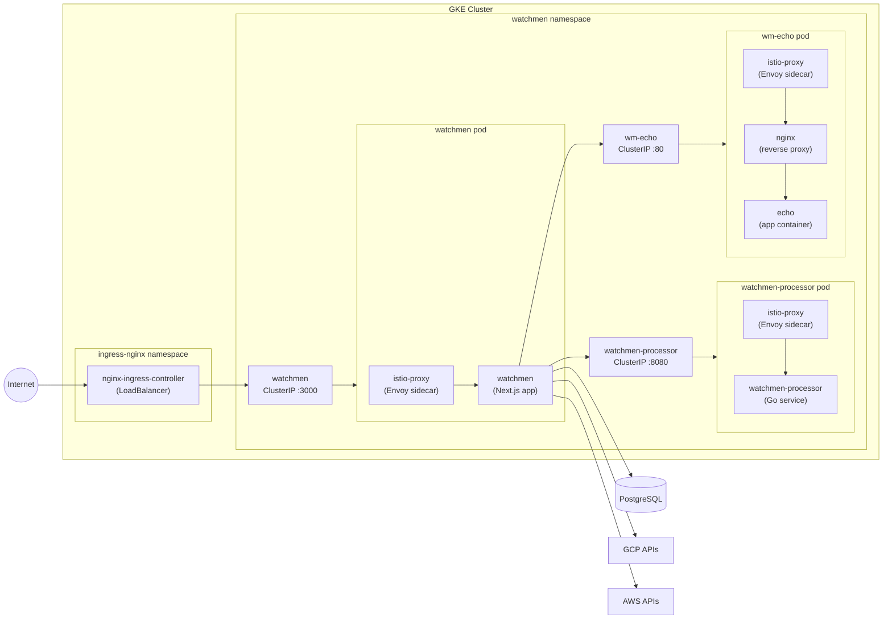
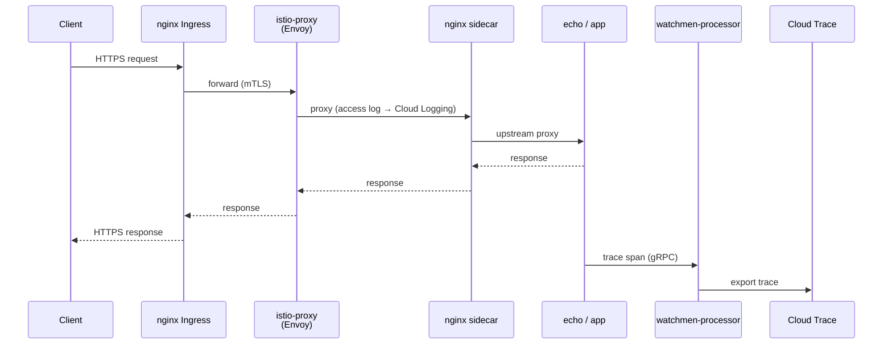
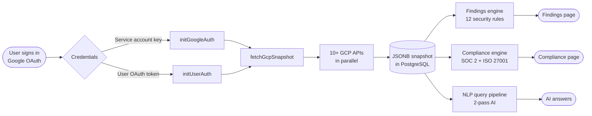
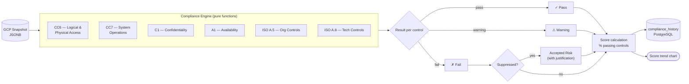
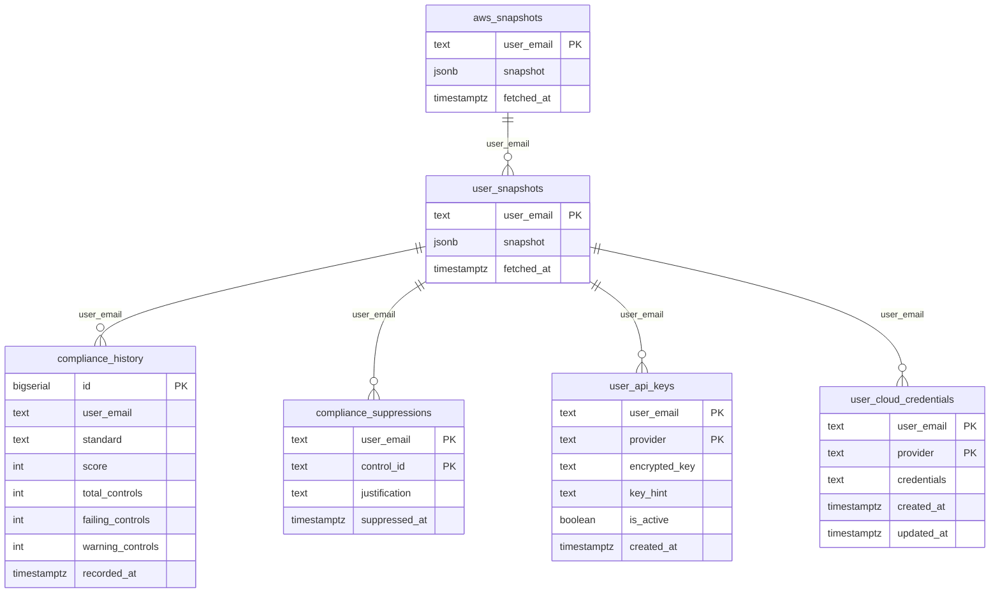

# Watchmen — Architecture

## System overview

```mermaid
graph TD
    subgraph Browser["Browser"]
        UI["Next.js 15 App Router\n(React 19)"]
    end

    subgraph Server["Server (Next.js API Routes)"]
        Auth["NextAuth v5\nGoogle OAuth"]
        Scan["/api/scan\nGCP + AWS snapshot"]
        Query["/api/query\nNLP 2-pass pipeline"]
        Compliance["/api/compliance\nSOC 2 / ISO 27001"]
        Findings["/api/findings\nSecurity rules engine"]
        AIRoute["/api/*/ai\nAI recommendations"]
        LogsAI["/api/logs/analyze\nAI log analysis"]
        Trace["/api/trace\nRequest tracing"]
        Proxy["/api/proxy\nOutbound HTTP proxy"]
    end

    subgraph Storage["Persistence"]
        PG[("PostgreSQL\nSnapshots · Compliance\nKeys · Suppressions")]
    end

    subgraph AIProviders["AI Providers (user-owned keys)"]
        Claude["Anthropic Claude\nclaude-sonnet-4-6"]
        Gemini["Google Gemini\ngemini-2.5-flash"]
        OpenAI["OpenAI\ngpt-4o-mini"]
    end

    subgraph GCPAPIs["GCP APIs"]
        CRAPI["Cloud Resource Manager"]
        IAMAdmin["IAM Admin"]
        GKEApi["GKE / Container"]
        CloudSQL["Cloud SQL Admin"]
        CloudRun["Cloud Run"]
        GCS["Cloud Storage"]
        BQ["BigQuery"]
        PubSub["Pub/Sub"]
        SecretMgr["Secret Manager"]
        Compute["Compute Engine"]
        Logging["Cloud Logging"]
        CloudTrace["Cloud Trace"]
    end

    subgraph AWSAPIs["AWS APIs (SDK v3)"]
        IAMAPI["IAM"]
        EC2API["EC2"]
        EKSAPI["EKS"]
        RDSAPI["RDS"]
        LambdaAPI["Lambda"]
        S3API["S3"]
        SNSAPI["SNS"]
        SecretsAPI["Secrets Manager"]
        RedshiftAPI["Redshift"]
        ELBAPI["ELB / ALB"]
    end

    subgraph K8s["Kubernetes Cluster (optional)"]
        Processor["watchmen-processor\n(Go service)"]
        Echo["wm-echo\n(test app)"]
    end

    UI --> Auth
    UI --> Scan
    UI --> Query
    UI --> Compliance
    UI --> Findings
    UI --> AIRoute
    UI --> LogsAI
    UI --> Trace
    UI --> Proxy

    Scan --> PG
    Query --> PG
    Compliance --> PG
    Findings --> PG
    Auth --> PG

    Query --> Claude
    Query --> Gemini
    Query --> OpenAI
    AIRoute --> Claude
    AIRoute --> Gemini
    AIRoute --> OpenAI
    LogsAI --> Claude
    LogsAI --> Gemini
    LogsAI --> OpenAI

    Scan --> CRAPI
    Scan --> IAMAdmin
    Scan --> GKEApi
    Scan --> CloudSQL
    Scan --> CloudRun
    Scan --> GCS
    Scan --> BQ
    Scan --> PubSub
    Scan --> SecretMgr
    Scan --> Compute

    Scan --> IAMAPI
    Scan --> EC2API
    Scan --> EKSAPI
    Scan --> RDSAPI
    Scan --> LambdaAPI
    Scan --> S3API
    Scan --> SNSAPI
    Scan --> SecretsAPI
    Scan --> RedshiftAPI
    Scan --> ELBAPI

    Trace --> Logging
    Trace --> CloudTrace
    Trace --> Processor

    Processor --> Echo
    Processor --> CloudTrace
```



---

## Kubernetes deployment topology

> **Note — sample application:** The diagrams and manifests in this section describe the **sample stack bundled in this repository** (`services/request-processor`, `services/test-echo`, `k8s/`). They exist so you can spin up a working demo cluster and immediately see live request traces in the Request Tracer. You are not required to run this sample stack — you can point Watchmen at any existing GKE cluster that already has Istio and Cloud Logging enabled.

When deployed on Kubernetes with Istio, every pod receives an Envoy sidecar that intercepts all in-pod network traffic. The topology graph in the Request Tracer page reflects this physical signal flow.



---

## Live request signal flow

> **Note — sample application:** This flow uses the `wm-echo` test app and `watchmen-processor` Go service that ship with this repo. The same signal path applies to any Istio-enabled workload you connect — swap `wm-echo` for your own service and the topology graph will reflect your traffic.

When a real HTTP request arrives at the cluster, it passes through each sidecar in order. The Request Tracer page visualises this as an animated pulse.



---

## GCP scan pipeline



---

## AI query pipeline

```mermaid
flowchart TD
    Q([User question]) --> A[/api/query]
    A --> B{Resolve AI key}
    B -->|User DB key| C[Decrypt AES-256-GCM]
    B -->|Browser key| D[From localStorage]
    C --> E[Pass 1: Intent extraction\nidentify resource type + filter]
    D --> E
    E --> F[Extract matching resources\nfrom cached snapshot]
    F --> G[Pass 2: Answer generation\nAI summarises filtered data]
    G --> H([Structured answer\nwith resource list])
```

---

## Compliance engine flow



---

## Database schema



---

## Key design decisions

### Per-user OAuth scanning
Each signed-in user's GCP data is fetched using **their own OAuth access token** obtained during Google sign-in (`cloud-platform` scope). The service account key (`GCP_SERVICE_ACCOUNT_KEY`) is used only as a server-side fallback for background re-scans. Watchmen never requires org-wide service account permissions that exceed what the individual user already has.

### Snapshot-based queries
GCP and AWS APIs are called once per scan, and the result is serialised as JSONB in Postgres. All subsequent NLP queries, finding computations, and compliance reports read from this cached snapshot — no extra API calls at query time. The dashboard triggers a fresh scan automatically every 10 minutes in the background.

### AI keys are user-owned
Every AI API call uses the key the user added in **Settings → AI Keys**. Keys are AES-256-GCM encrypted (using `AUTH_SECRET` as the key material) before being stored in Postgres. No server-side AI key is required at deploy time.

### Pure-function compliance engine
All SOC 2 and ISO 27001 control checks are pure functions in `lib/compliance/checks.ts`. They take a snapshot object and return pass/fail/warning evidence lists. No API calls happen during compliance report generation.

---

## Component map

| Path | Purpose |
|---|---|
| `lib/auth.ts` | NextAuth config — Google provider, JWT/session callbacks, email/domain allowlist |
| `lib/db.ts` | Re-exports `sql` from `@vercel/postgres` — works with any PostgreSQL URL |
| `lib/gcp/client.ts` | SA auth (`initGoogleAuth`), user OAuth auth (`initUserAuth`), org-level project enumeration |
| `lib/gcp/index.ts` | `fetchGcpSnapshot()` — orchestrates all GCP fetchers |
| `lib/gcp/types.ts` | All GCP type definitions |
| `lib/aws/` | AWS SDK wrappers — one file per service (iam, ec2, eks, rds, lambda, s3, …) |
| `lib/aws-findings.ts` | `computeAwsFindings()` — 8 security rules, pure function |
| `lib/claude/query-processor.ts` | 2-pass AI flow: intent extraction → answer generation |
| `lib/ai/client.ts` | `resolveAI()`, `callAI()` — provider-agnostic abstraction (Gemini, Claude, OpenAI) |
| `lib/compliance/checks.ts` | 18 shared GCP check functions (pure) |
| `lib/compliance/soc2.ts` | SOC 2 Type II report builder (18 controls) |
| `lib/compliance/iso27001.ts` | ISO 27001:2022 report builder (18 controls) |
| `lib/findings.ts` | `computeFindings()` — 12 GCP security rules, pure function |
| `services/request-processor/` | Go service — receives trace spans, exports to Cloud Trace |
| `services/test-echo/` | Lightweight echo app for topology demos |
| `fixtures/` | Mock JSON for development without cloud credentials |

---

## GCP resources scanned

| Resource | API | Fields captured |
|---|---|---|
| IAM / Projects | Cloud Resource Manager v1 | Bindings (role → members) |
| Service Accounts | IAM Admin v1 | Keys, roles, disabled state |
| Storage Buckets | Storage v1 | IAM policy, location, versioning |
| GKE Clusters | Container v1 | Version, node count, Workload Identity, private nodes |
| VMs | Compute v1 | Zone, machine type, external IP, service account |
| Cloud Run | Run v1 | Region, service account, IAM policy |
| Cloud SQL | SQL Admin v1beta4 | Public IP, backup enabled, SSL required |
| BigQuery | BigQuery v2 | Dataset IAM policy, location |
| Pub/Sub | Pub/Sub v1 | Topic IAM policy |
| Secret Manager | SecretManager v1 | IAM policy, replication policy |
| Firewall Rules | Compute v1 | Direction, source ranges, allowed ports |
| Cloud Logging | Logging v2 | Container logs (live view + AI analysis) |

## AI provider support

| Provider | Model | Key format |
|---|---|---|
| Google Gemini | `gemini-2.5-flash` | `AIza…` |
| Anthropic Claude | `claude-sonnet-4-6` | `sk-ant-…` |
| OpenAI | `gpt-4o-mini` | `sk-…` |

Keys are validated against the live API before being saved, then AES-256-GCM encrypted in Postgres. Only the last 4 characters are stored in plaintext as a hint.
