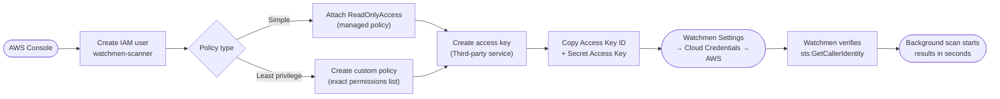

# AWS Setup Guide

Watchmen scans your AWS account for security misconfigurations across IAM, EC2, RDS, Lambda, S3, EKS, and more. AWS credentials are configured **per user** through the Watchmen UI — no server-side environment variables are needed.

## Setup flow



---

## What Watchmen scans

| Service | Resources |
|---|---|
| IAM | Users, roles, access keys, attached policies, MFA status |
| EC2 | Instances, security groups |
| EKS | Clusters |
| RDS | Database instances and clusters |
| Lambda | Functions, resource policies |
| S3 | Buckets, public access configuration, bucket policies |
| SNS | Topics |
| Secrets Manager | Secrets |
| Redshift | Clusters |
| ELB / ALB | Load balancers |

---

## Creating an IAM user for scanning

### Step 1 — Create a dedicated IAM user

**AWS Console:**

```
IAM → Users → Create user
User name: watchmen-scanner
```

Leave "Provide user access to the AWS Management Console" unchecked — this user only needs programmatic access.

**AWS CLI:**

```bash
aws iam create-user --user-name watchmen-scanner
```

---

### Step 2 — Attach a permissions policy

#### Option A — AWS managed policy (simplest)

Attach the `ReadOnlyAccess` managed policy. This grants read-only access to all AWS services.

**Console:** Users → watchmen-scanner → Add permissions → Attach policies directly → search `ReadOnlyAccess` → Next → Add permissions.

**CLI:**

```bash
aws iam attach-user-policy \
  --user-name watchmen-scanner \
  --policy-arn arn:aws:iam::aws:policy/ReadOnlyAccess
```

#### Option B — Custom least-privilege policy (recommended)

Create a policy with exactly the permissions Watchmen needs, and nothing more:

```bash
cat > watchmen-policy.json << 'EOF'
{
  "Version": "2012-10-17",
  "Statement": [
    {
      "Sid": "WatchmenReadOnly",
      "Effect": "Allow",
      "Action": [
        "iam:ListUsers",
        "iam:ListRoles",
        "iam:ListAccessKeys",
        "iam:ListAttachedUserPolicies",
        "iam:ListAttachedRolePolicies",
        "iam:ListUserPolicies",
        "iam:GetUser",
        "iam:GetRole",
        "iam:GetLoginProfile",
        "iam:GetUserPolicy",
        "iam:ListMFADevices",
        "ec2:DescribeInstances",
        "ec2:DescribeSecurityGroups",
        "ec2:DescribeRegions",
        "elasticloadbalancing:DescribeLoadBalancers",
        "elasticloadbalancing:DescribeTargetGroups",
        "eks:ListClusters",
        "eks:DescribeCluster",
        "rds:DescribeDBInstances",
        "rds:DescribeDBClusters",
        "lambda:ListFunctions",
        "lambda:GetPolicy",
        "s3:ListAllMyBuckets",
        "s3:GetBucketPublicAccessBlock",
        "s3:GetBucketPolicy",
        "s3:GetBucketAcl",
        "s3:GetBucketLocation",
        "sns:ListTopics",
        "sns:GetTopicAttributes",
        "secretsmanager:ListSecrets",
        "redshift:DescribeClusters",
        "sts:GetCallerIdentity"
      ],
      "Resource": "*"
    }
  ]
}
EOF

# Create the policy
aws iam create-policy \
  --policy-name WatchmenScannerPolicy \
  --policy-document file://watchmen-policy.json

# Attach it to the user (replace ACCOUNT_ID)
aws iam attach-user-policy \
  --user-name watchmen-scanner \
  --policy-arn arn:aws:iam::ACCOUNT_ID:policy/WatchmenScannerPolicy

rm watchmen-policy.json
```

---

### Step 3 — Create an access key

**Console:**

```
IAM → Users → watchmen-scanner → Security credentials → Create access key
Purpose: Third-party service → Next → add description → Create access key
```

**CLI:**

```bash
aws iam create-access-key --user-name watchmen-scanner
```

Copy the **Access Key ID** and **Secret Access Key**. The secret is only shown once.

---

### Step 4 — Add the credentials in Watchmen

1. Open Watchmen and go to **Settings → Cloud Credentials → AWS**.
2. Enter:
   - **Access Key ID** (starts with `AKIA...`)
   - **Secret Access Key**
   - **Region(s)** — the AWS region(s) to scan, e.g. `us-east-1` or `us-east-1,eu-west-1,ap-southeast-1`
3. Click **Save**.

Watchmen verifies the credentials with `sts:GetCallerIdentity` and immediately starts a background scan. Results appear in the AWS section of the dashboard within a few seconds.

---

## Multi-region scanning

Enter a comma-separated list of regions in the region field to scan multiple regions simultaneously:

```
us-east-1,us-west-2,eu-west-1,ap-southeast-1
```

All regions are scanned in parallel. IAM resources (users, roles) are global and are only fetched once regardless of region count.

---

## Security notes

- The access key is encrypted at rest in the database using AES-256-GCM with your `AUTH_SECRET`.
- Watchmen never requires write permissions to your AWS account. All actions are read-only.
- Rotate the access key regularly. In the IAM console under `watchmen-scanner → Security credentials`, delete the old key and create a new one, then update the credentials in Watchmen Settings.
- To revoke access at any time: deactivate or delete the access key in the IAM console.

---

## Finding what Watchmen checks for

Watchmen evaluates the following security rules on every scan:

| Finding | Severity |
|---|---|
| IAM user without MFA enabled | HIGH |
| IAM user with `AdministratorAccess` attached | CRITICAL |
| Access key active for more than 90 days | MEDIUM |
| User with more than one active access key | MEDIUM |
| S3 bucket with public access enabled | CRITICAL |
| Lambda function with overly permissive resource policy | HIGH |
| RDS instance with `PubliclyAccessible = true` | HIGH |
| EC2 security group open to 0.0.0.0/0 on all ports | CRITICAL |

Results appear on the **Findings** page and are included in the SOC 2 / ISO 27001 compliance reports.
